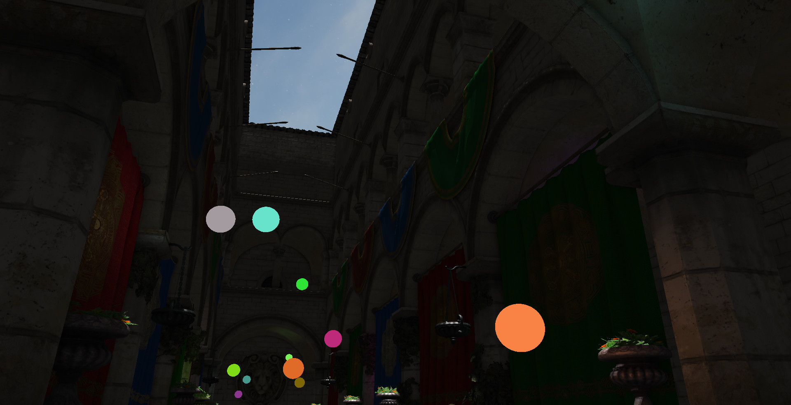
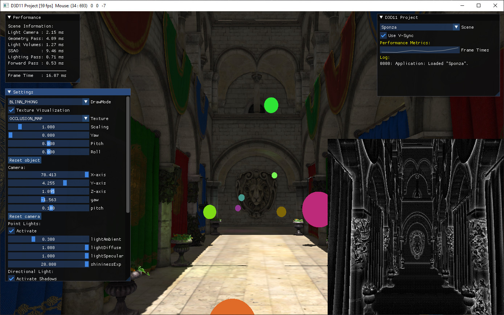
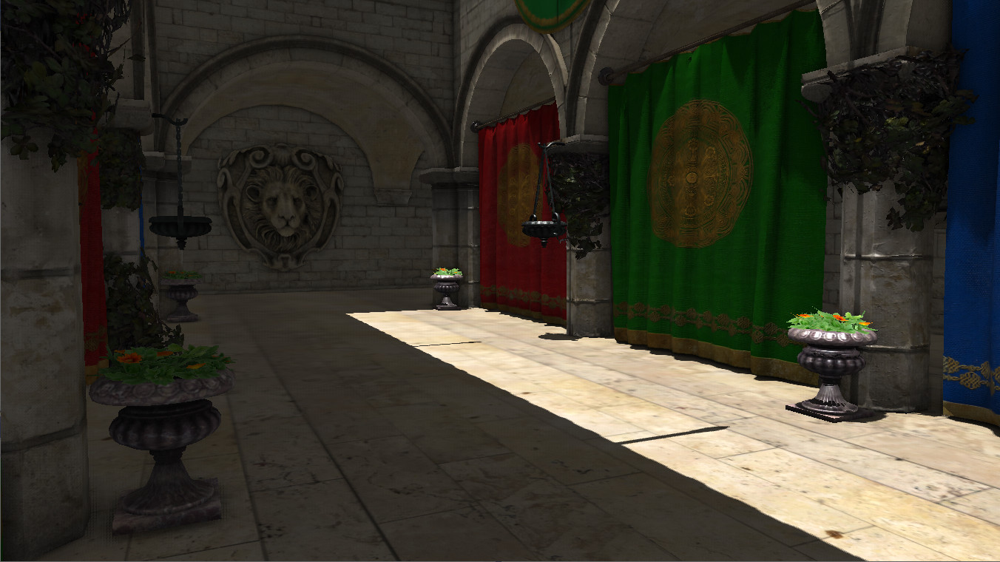
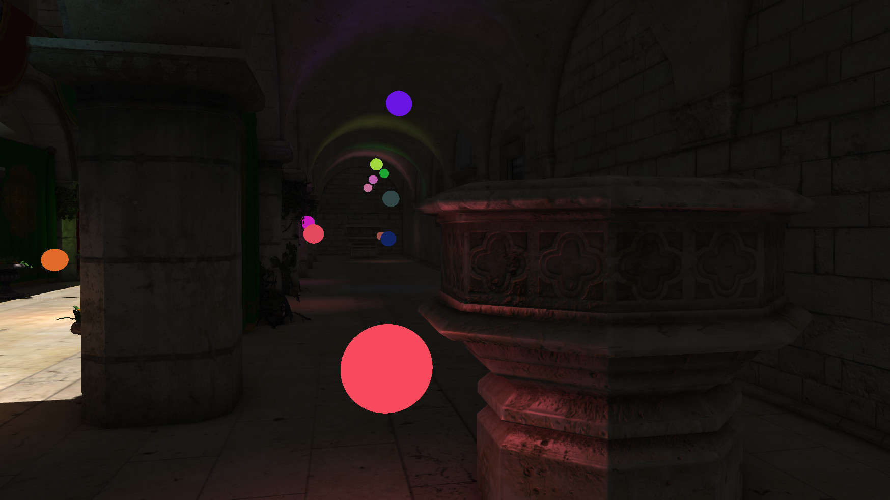
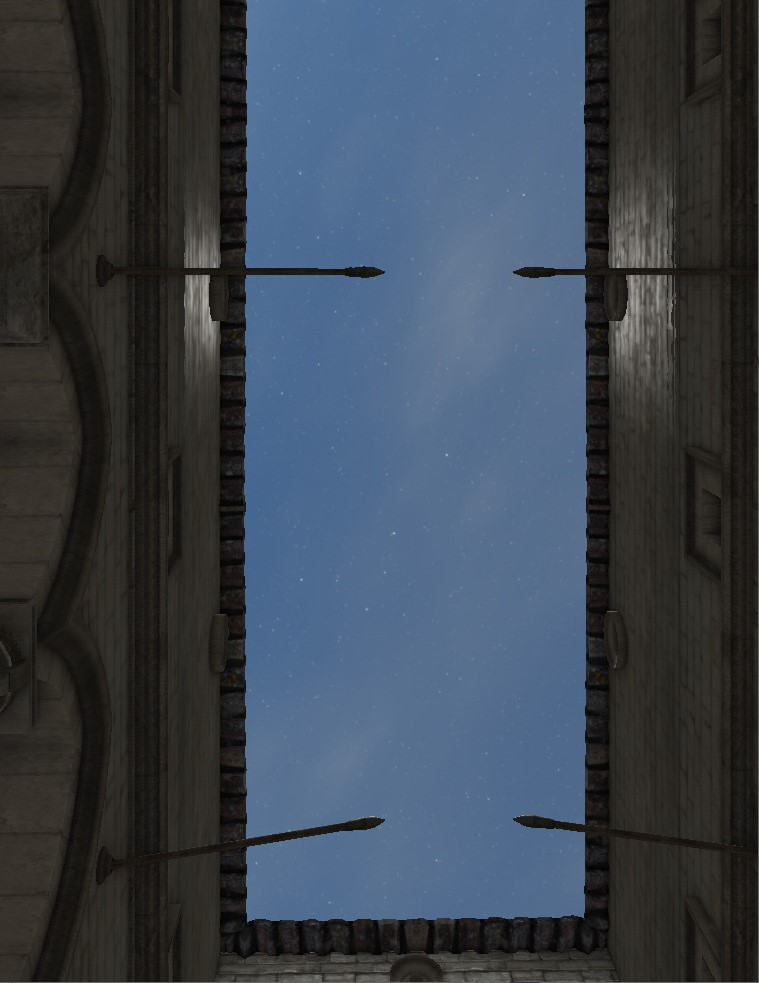
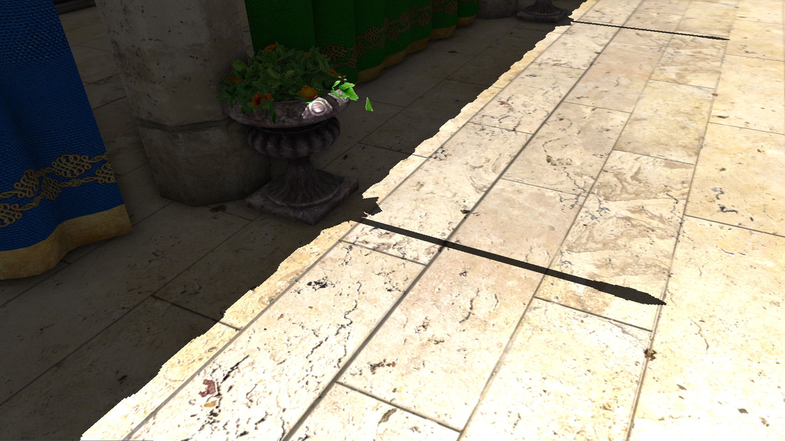
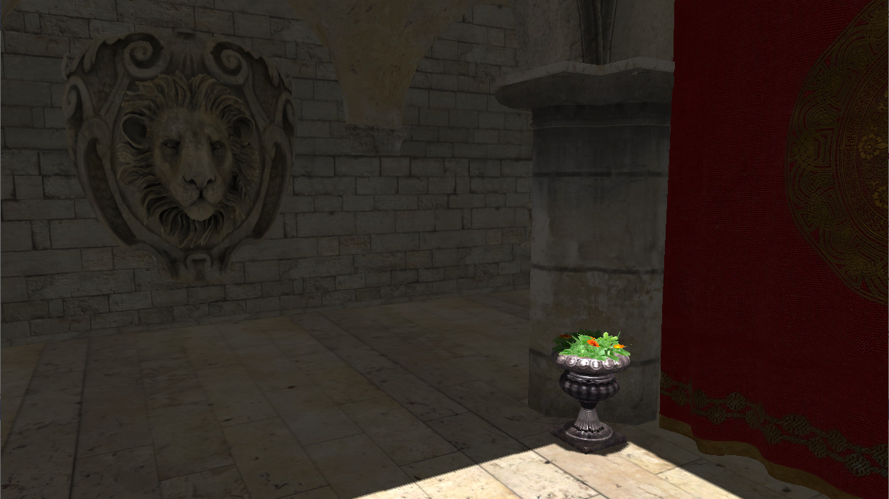
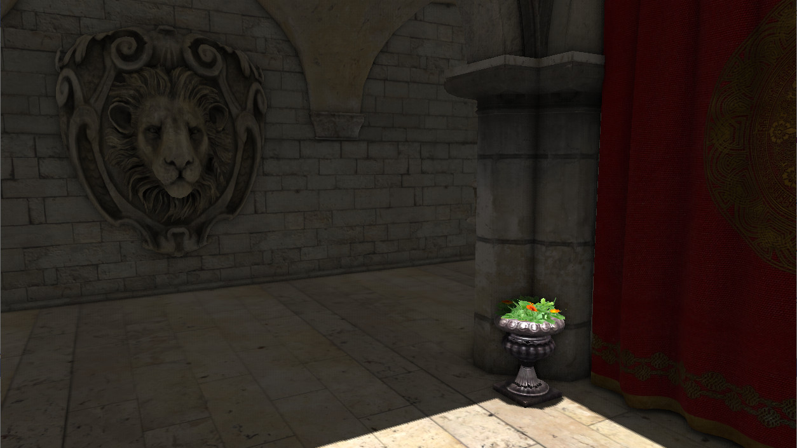
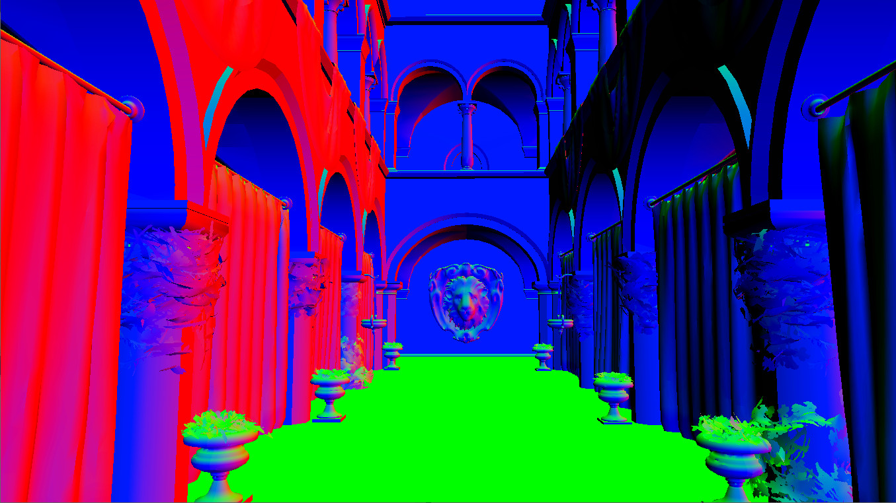
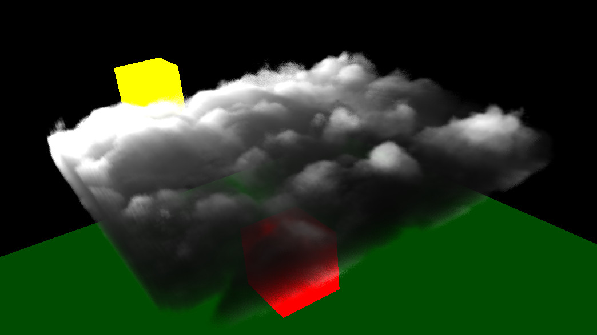

# Basic D3D11 Renderer (WIP)

A basic D3D11 renderer that acts as my personal playground for testing out several graphics concepts:

  <kbd>
    
  </kbd>

Description
-------
This renderer utilizes [SimpleMath](https://github.com/Microsoft/DirectXTK/wiki/SimpleMath) for convenient matrix and vector calculations. The graphical user interface is powered by [Dear ImGui](https://github.com/ocornut/imgui) library, ensuring an intuitive user experience.

For efficient handling of model and texture loading, integration with [assimp](https://github.com/assimp/assimp) is employed. The main scene features an updated version of the well-known [Sponza](https://github.com/SaschaWillems/VulkanSponza) scene, showcasing the capabilities of the renderer.

**Note**: This project is currently in an early stage of development and is a work in progress. There are numerous areas that require further enhancement and refinement.

Features
-------
- [x] Blinn-Phong Shading
- [x] Normal Mapping
- [x] Shadow Mapping: Directional Light, Adaptive Light Frustum, Basic PCF
- [x] Sky Box (Cube Map)
- [x] Deferred Rendering: Spherical Light Volumes
- [x] Screen Space Ambient Occlusion (SSAO)
- [ ] Screen Space Reflections (SSR)
- [ ] Volumetric Clouds Port From OpenGL
- [ ] Physically Based Rendering (PBR)
- [ ] Screen Space Subsurface Scattering (SSSS)

Gallery
-------
Application Window             |  Shadows
:-------------------------:|:-------------------------:
  |  

Point Lights             |  Sky Box
:-------------------------:|:-------------------------:
  |  

Hard Shadows             |  Soft Shadows (PCF)
:-------------------------:|:-------------------------:
  |  

SSAO Off             |  SSAO On
:-------------------------:|:-------------------------:
  |  

Vertex Normals             |  Normal Mapping
:-------------------------:|:-------------------------:
  |  

TODOs
-------
Add volumetric clouds from a previous OpenGL project:
<table style="width: 100%;">
  <tr>
    <td align="center">Application</td>
    <td align="center">Animation</td>
  </tr>
  <tr>
    <td align="center">
      
    </td>
    <td align="center">
      
    </td>
  </tr>
</table>

Pipeline Details
-------
1. Light Camera Pass: For directional light shadow mapping
2. Geometry Pass: Render the scene objects
3. Light Volume Pass: Instanced rendering of light spheres that represent point lights
4. SSAO Occlusion Map: Calculation of a occlusion map + blur
5. Lighting Pass: Combine information from previous steps
6. Forward Pass: Draw objects with separate lighting procedures

G-Buffer Details
-------
The G-Buffer aims to have a very small memory footprint:

| Function | Texture Format | bits per pixel|
|----------|----------|----------|
| WS Normals | DXGI_FORMAT_R8G8_UNORM | 16 |
| Diffuse/Albedo + Specular | DXGI_FORMAT_R8G8B8A8_UNORM | 32 |
| Depth Buffer | DXGI_FORMAT_R24G8_TYPELESS | 32 |

Other Details
-------
* Light camera frustum is adaptive to view camera frustum (always fully covered)
* Normals are getting encoded/decoded to Octahedron-normal vectors.
* 10x buffering for GPU profiler

Built And Tested With
-------
* Windows 10
* Windows SDK 10.0.19041.0
* Visual Studio 2019 (v142)

References
-------
* https://learnopengl.com/
* https://learn.microsoft.com/en-us/windows/uwp/gaming/directx-programming
* https://github.com/planetchili/hw3d
* https://www.3dgep.com/forward-plus/#Deferred_Shading
* https://knarkowicz.wordpress.com/2014/04/16/octahedron-normal-vector-encoding/
* https://www.reedbeta.com/blog/gpu-profiling-101/

License
-------
This project is licensed under the MIT License, see [LICENSE.txt](https://github.com/fisherman1504/render_project/blob/main/LICENSE.txt) for more information.

